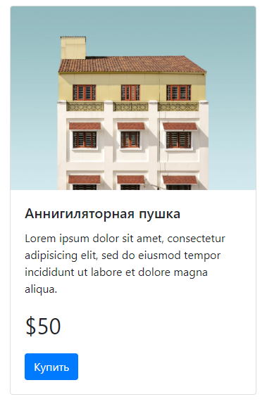
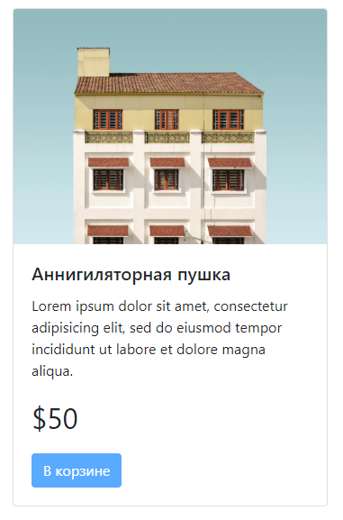

# Как задействовать в верстке React.js

## Базовая верстка карточки товара

    

        
        

            <h5 class="card-title">Аннигиляторная пушка</h5>
            
Lorem ipsum dolor sit amet, consectetur adipisicing elit, sed do eiusmod tempor incididunt ut labore et dolore magna aliqua.

            
$50

            <button class="btn btn-primary">Купить</button>
        

    

## Готовим к работе с js

    

        
        

            <h5 class="card-title">Аннигиляторная пушка</h5>
            
Lorem ipsum dolor sit amet, consectetur adipisicing elit, sed do eiusmod tempor incididunt ut labore et dolore magna aliqua.

            
$50

            

        

    

## Создаем react-компонент кнопки, который пока ничего не делает

Поместим его в `./src/scripts/main/react/components/BuyBtn.js`:

    import React from "react";
    export class BuyBtn extends React.Component {
        render() {
            return (
                <button className="btn btn-primary">Купить</button>
            );
        }
    }

Затем нужно этот простой компонент отрендерить. Это можно сделать в скрипте `./src/scripts/main/components/ProductCard.js`, который мы использовали в [рецепте по изоляции js-логики](08-incapsulate-js-logic.md):

    import React from "react";
    import ReactDOM from "react-dom";
    import {BuyBtn} from "@main/react/components/BuyBtn";

    class ProductCard {
        constructor(el) {
            this.element = el;
            this.productId = this.element.getAttribute("data-product-id");
            this.buyBtnContainer = this.element.querySelector(".js-buy-btn");
            this.initBuyBtn();
        }

        initBuyBtn() {
            ReactDOM.render(
                React.createElement(BuyBtn, {}, null),
                this.buyBtnContainer
            );
        }
    }

    document.querySelectorAll(".js-product-card").forEach(card => new ProductCard(card));

## Добавляем react-кнопке поведение

Сначала передадим кнопке идентификатор товара через props. В файле `./src/scripts/main/components/ProductCard.js`:

    initBuyBtn() {
        ReactDOM.render(
            React.createElement(BuyBtn, {productId: this.productId}, null),
            this.buyBtnContainer
        );
    }

Затем в компоненте кнопки `./src/scripts/main/react/components/BuyBtn.js` опишем начальное состояние:

    constructor(props) {
        super(props);
        this.state = { disabled: false, text: "Купить" };
        this.buy = this.buy.bind(this);
    }

Изменим рендер-функцию, чтобы внешний вид кнопки зависел от состояния:

    render() {
        return (
            <button className="btn btn-primary" disabled={this.state.disabled} onClick={this.buy}>{this.state.text}</button>
        );
    }

Добавим обработчик нажатия:

    buy(e) {
        e.preventDefault();
        if (this.state.disabled) return;
        $.post("/api/basket/add", {product_id: this.props.productId});
        this.setState({
            disabled: true,
            text: "В корзине"
        })
    }

## Что получилось

Начальное состояние:

После покупки:

